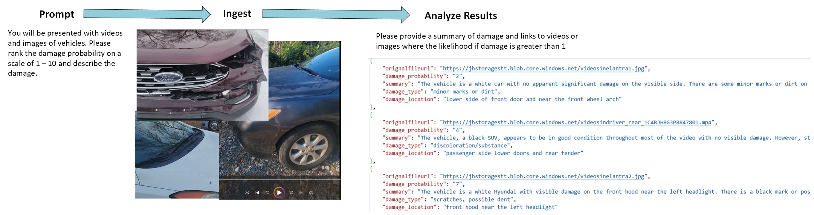
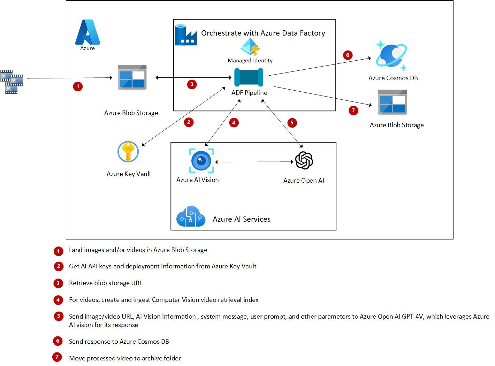
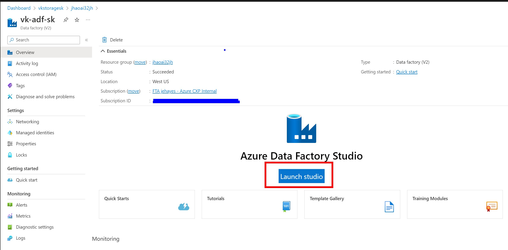
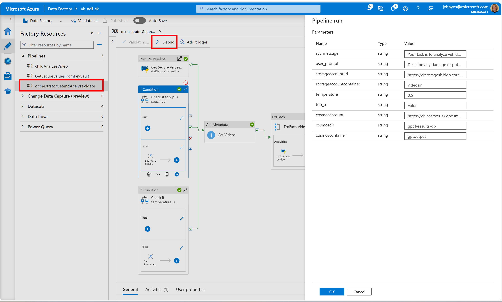
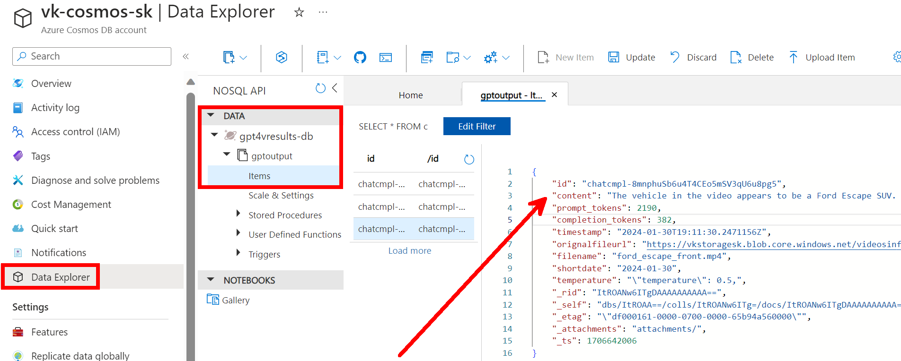
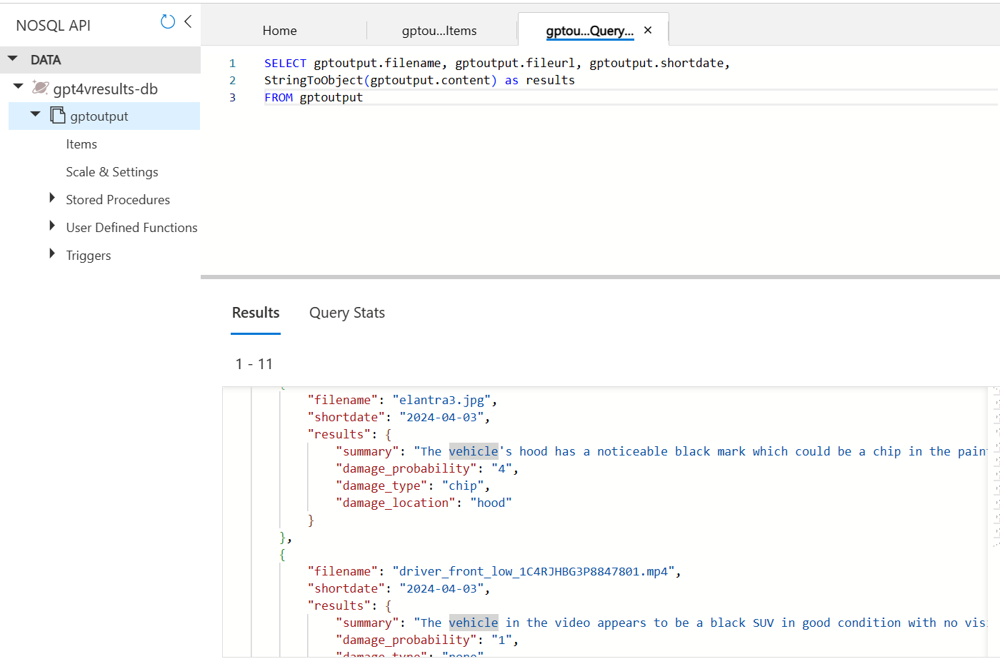
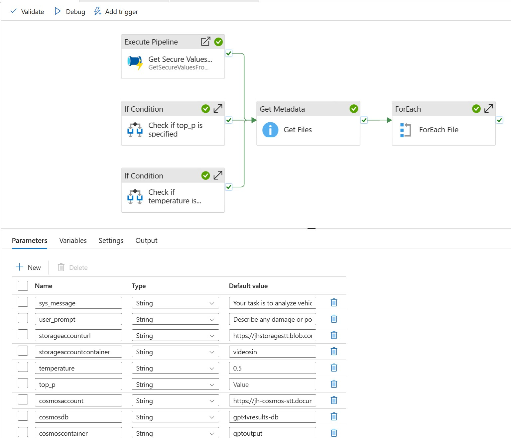
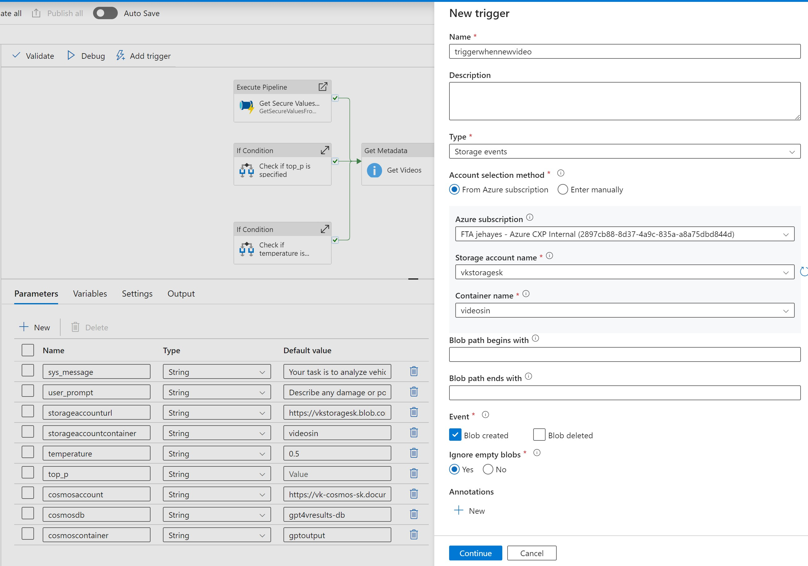
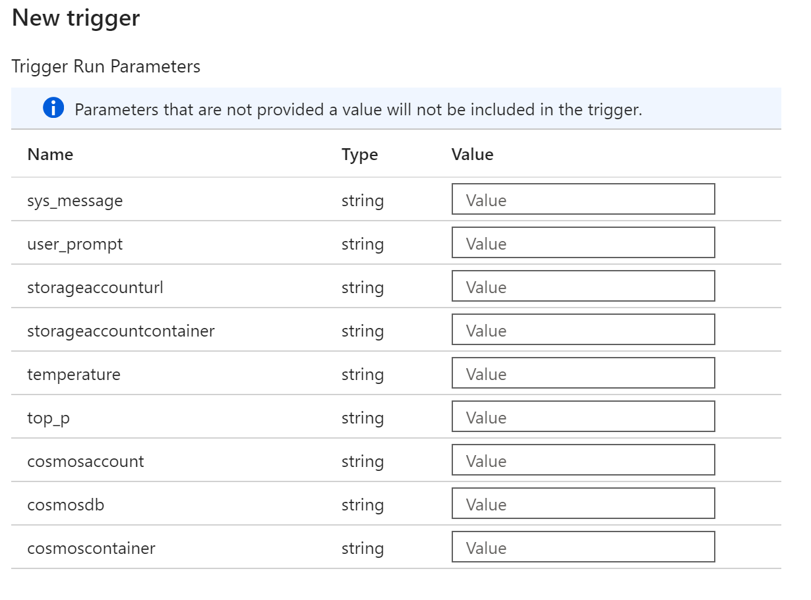

# AI-in-a-Box - Image and Video Analysis with Azure Open AI GPT-4 Turbo with Vision and Azure Data Factory

<!-- 

  

    This solution is part of the the AI-in-a-Box framework developed by the team of Microsoft Customer Engineers and Architects to accelerate the deployment of AI and ML solutions. Our goal is to simplify the adoption of AI technologies by providing ready-to-use accelerators that ensure quality, efficiency, and rapid deployment.
  

  

    
  

 -->

|||
|:---| ---:|
|This solution is part of the the AI-in-a-Box framework developed by the team of Microsoft Customer Engineers and Architects to accelerate the deployment of AI and ML solutions. Our goal is to simplify the adoption of AI technologies by providing ready-to-use accelerators that ensure quality, efficiency, and rapid deployment.|  |

## User Story

Azure Open AI GPT-4 Turbo with Vision (AOAI GPT-4V) allows you to analyze your own videos to gain insights from your images and videos without needing to develop and train your own model, which can be a time and cost consuming process. This opens up a multitude of test cases for different industries including:

- Assessing videos or images provided for insurance claims
- Identifying product defects in a manufacturing process
Tracking store traffic, including items browsed, loss protection
- Identifying animal movement in a forest or preserve without having to watch hours of videos
  
Yet, for those not versed in Python or .NET, tapping into Azure Open AI's potential can seem daunting. Azure Data Factory (ADF) steps in as a low-code solution to orchestrate Azure Open AI service calls and manage output ingestion. ADF has features that allow for easy configuration, customization, and parameterization of prompts and other AOAI inputs as well as data sources. These customization and parameterization features make pipelines reusable for ingesting different images and videos with different prompts and system messages.

## What's in the Box

- Sample images, videos, chat completion prompts to analyze images and videos of videos for damage
- Low-code solution using ADF
- Easy and secure integration with other Azure resources with Managed Identities
- Parameterization making a single data factory reuseable for many different scenarios
- Results stored in Azure Cosmos DB in Json Format
- Deployment of all resources needed for Image and Video Analysis with GPT-4V and ADF. This includes:
  - [Azure Key Vault](https://learn.microsoft.com/en-us/azure/key-vault/general/quick-create-portal)
  - [Azure Open AI With a GPT-4V (Preview) Deployment](https://learn.microsoft.com/en-us/azure/ai-services/openai/how-to/create-resource?pivots=web-portal)
    - [Check here for available models and regions](https://learn.microsoft.com/en-us/azure/ai-services/openai/concepts/models#gpt-4-and-gpt-4-turbo-preview-model-availability)
  - [Azure AI Vision with Image Analysis](https://learn.microsoft.com/en-us/azure/ai-services/computer-vision/how-to/video-retrieval#prerequisites)
  - [Azure Blob Storage for ingesting and archiving the videos and images](https://learn.microsoft.com/en-us/azure/storage/common/storage-account-create?tabs=azure-portal)
  - [Azure Data Factory along with all Data Factory artifacts](https://learn.microsoft.com/en-us/azure/data-factory/quickstart-create-data-factory)
    - Artifacts include all pipelines and activities needed to call GPT-4V vision to analyze your videos and images and store the results in Azure Cosmos DB
  - [Azure Cosmos DB for storing chat comption results](https://learn.microsoft.com/en-us/azure/cosmos-db/nosql/quickstart-portal)

For detailed information on this solution refer to:  
    [Analytics Videos with Azure Open AI GPT-R Turbo with Vision and Azure Data Factory](https://techcommunity.microsoft.com/t5/fasttrack-for-azure/analyze-videos-with-azure-open-ai-gpt-4-turbo-with-vision-and/ba-p/4032778)  
    [Analytics Videos with Azure Open AI GPT-R Turbo with Vision and Azure Data Factory](https://techcommunity.microsoft.com/t5/fasttrack-for-azure/image-analysis-with-azure-open-ai-gpt-4v-and-azure-data-factory/ba-p/4117969)
  
## Thinking Outside of the Box

The solution is extremely adaptable for your own use cases.

- Add your own videos and images to the storage account and change the system and user prompts for the chat completion.
- The ADF orchestration pipeline processes all the files and images in a folder. This is perfect if you want to analyze images/videos on a batch basis. However, you may want to analyze a video or image as soon as it lands in the storage account. In that case, run the orchestration pipeline to test your system and user prompts in batch mode. Then add an event based trigger to analyze the video or image as soon as it lands in a storage account.
- Build vector analytics over the Cosmos DB upon chat completion results

## Deploy the Solution
Install, deploy, upload sample videos and/or images

### Prerequisites for running locally:
1. Install latest version of [Azure CLI](https://docs.microsoft.com/en-us/cli/azure/install-azure-cli-windows?view=azure-cli-latest)
2. Install latest version of [Bicep](https://docs.microsoft.com/en-us/azure/azure-resource-manager/bicep/install)
3. Install latest version of [Azure Devloper CLI](https://learn.microsoft.com/en-us/azure/developer/azure-developer-cli/install-azd)
4. Install latest version of [Azure Function Core Tools](https://learn.microsoft.com/en-us/azure/azure-functions/functions-run-local?tabs=windows%2Cisolated-process%2Cnode-v4%2Cpython-v2%2Chttp-trigger%2Ccontainer-apps&pivots=programming-language-python#install-the-azure-functions-core-tools)

### Deploy to Azure

1. Clone this repository locally
    `git clone https://github.com/Azure/AI-in-a-Box`  
2. Deploy resources
  `cd gen-ai/a-services/gpt-video-analysis-in-a-box`  
  `azd auth login`
  `azd up`

You will be prompted for a subscription, a region for GPT-4V, a region for AI Vision, a resource group, a prefix and a suffix. The parameter called **location must be a region that supports GPT-4V** ; the parameter called **CVlocation must be a region that supports AI Vision Image Analysis 4.0**.

### Post deployment - upload videos and/or images

Upload images and videos of vehicles to your new storage account's **videosin** container using [Azure Storage Explorer](https://learn.microsoft.com/en-us/azure/vs-azure-tools-storage-manage-with-storage-explorer), [AZ Copy](https://learn.microsoft.com/en-us/azure/storage/common/storage-use-azcopy-files#upload-the-contents-of-a-directory) or within the [Azure Portal](https://learn.microsoft.com/en-us/azure/storage/blobs/storage-quickstart-blobs-portal#upload-a-block-blob). You can find some sample images and videos at the bottom of this blog, [Analyze Videos with Azure Open AI GPT-4 Turbo with Vision and Azure Data Factory](https://techcommunity.microsoft.com/t5/fasttrack-for-azure/analyze-videos-with-azure-open-ai-gpt-4-turbo-with-vision-and/ba-p/4032778).

### Run the Solution

1. In the Azure portal, go to your newly created Azure Data Factory Resource and click launch:
   
2. Select the **orchestratorGetandAnalyzeVideos** pipeline, click Debug, and examine your preset pipeline parameter values. Then click OK to run.
   
3. After it runs successfully, go to your Azure Cosmos DB resource and examine the results in Data Explorer:
   
4. At this time, GPT4-V does not support response_format={"type": "json_object"}. However, if we still specify the chat completion to return the results in Json, we can specify a Cosmos query to convert the string to a Json object:
   

Here's the Cosmos SQL code below:

`SELECT gptoutput.filename, gptoutput.fileurl, gptoutput.shortdate,`  
       `StringToObject(gptoutput.content) as results`  
`FROM gptoutput`

## Customize the Solution

This solution is highly customizable due to the parameterization capabilities in Azure Data Factory. Below are the features you can parameterize out-of-the-box.

### Test prompts and other settings

When developing your solution, you can rerun it with different settings to get the best results from GPT-4V by tweaking the sys-message, user_prompt, temperature, and top_p values. 

### Change from batch to real-time

This solution is set to loop against a container of videos and images in batch, which is ideal for testing. However, when you move to production, you may want the video to be analyzed in real-time. To do this, you can set up a storage event trigger which will run when a file is landed in blob storage. 

Move the If Activity inside the For Each loop to the main Orchestrator pipeline canvas and hen eliminate the Get Metadata and For Each activities. Call the If activity after the variables are set and the parameters are retrieved from Key Vault. You can get the file name from the trigger metadata.

Read more [here](https://learn.microsoft.com/en-us/azure/data-factory/how-to-create-event-trigger?tabs=data-factory) for more information on ADF Storage event triggers

### Use the same Data Factory for other image and/or video analysis use cases

You can set up multiple triggers over your Azure Data Factory and pass different parameter values for whatever analysis you need to do: 

- You can set up different storage accounts for landing the files, then adjust the storageaccounturl and storageaccountcontainer parameters to ingest and analyze the images and/or videos.
- You can have different prompts and other values sent to GPT-4V in the sys_message, user_prompt, temperature, and top_p values for different triggers.
- You can land the data in a different Cosmos Account, Database and/or Container when setting the cosmosaccount, and cosmosdb, and cosmoscontainer values.

### Only analyze images or videos

If you are only analyzing images OR videos, you can delete the pipeline that is not needed (childAnalyzeImage or childAnalyzeVideo), eliminate the If activity inside the ForEach File activity and specify the Execute Pipeline activity for just the pipeline you need. However, it doesn't hurt to leave the unneeded pipeline there in case you want to use it in the future.

## How to Contribute

This project welcomes contributions and suggestions. Most contributions require you to agree to a Contributor License Agreement (CLA) declaring that you have the right to, and actually do, grant us the rights to use your contribution. For details, visit <https://cla.opensource.microsoft.com>

When you submit a pull request, a CLA bot will automatically determine whether you need to provide a CLA and decorate the PR appropriately (e.g., status check, comment). Simply follow the instructions provided by the bot. You will only need to do this once across all repos using our CLA.

This project has adopted the [Microsoft Open Source Code of Conduct](https://opensource.microsoft.com/codeofconduct/). For more information see the [Code of Conduct FAQ](https://opensource.microsoft.com/codeofconduct/faq) or contact <opencode@microsoft.com> with any additional questions or comments.
## Key Contacts & Contributors

Highlight the main contacts for the project and acknowledge contributors. You can adapt the structure from AI-in-a-Box:

| Contact | GitHub ID | Email |
|---------|-----------|-------|
| Your Name | @YourGitHub | your.email@example.com |

## Acknowledgments

If applicable, offer thanks to individuals, organizations, or projects that helped inspire or support your project.

## License

This project may contain trademarks or logos for projects, products, or services. Authorized use of Microsoft trademarks or logos is subject to and must follow [Microsoft's Trademark & Brand Guidelines](https://www.microsoft.com/en-us/legal/intellectualproperty/trademarks/usage/general). Use of Microsoft trademarks or logos in modified versions of this project must not cause confusion or imply Microsoft sponsorship. Any use of third-party trademarks or logos are subject to those third-party's policies.

---

This project is part of the AI-in-a-Box series, aimed at providing the technical community with tools and accelerators to implement AI/ML solutions efficiently and effectively.
